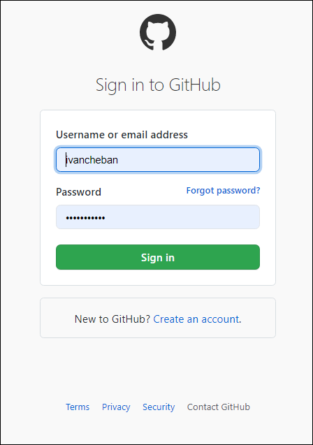

> When I first started exploring the CI/CD and the SSGs, the first generator that I learned was Jekyll. I used [Getting started with the Documentation Theme for Jekyll](https://idratherbewriting.com/documentation-theme-jekyll/) by Tom Johnson, the famous guru of technical writing known by his [I'd Rather Be Writing blog](https://idratherbewriting.com/).

So without too many words, let's start building our first documentation portal using Tom's Jekyll theme. I will try to explain even the evident things.

---

## Download or clone the theme from the [GitHub repo](https://github.com/tomjoht/documentation-theme-jekyll)

1. Sign up for GitHub.


2. If you already have the account there, sign in.



3. Now if you follow the [link to Tom's repo](https://github.com/tomjoht/documentation-theme-jekyll), you will see the contents of this repo that has the code and content for his example [documentation site](https://idratherbewriting.com/documentation-theme-jekyll/).


4. Click the **Code** button and select **Download ZIP**.


5. Save the ZIP file to your computer and unzip the contents where you like. Now you have the folder with code and content. Let's proceed with building our documentation site from all this.

---

## Install Ruby on Windows

> Before we install Jekyll that compiles our site, we need to install Ruby. Jekyll is a Ruby-based program and needs Ruby to run.

1. Go to [RubyInstaller for Windows](https://rubyinstaller.org/downloads/).
2. Install the recommended **Ruby+Devkit 2.6.X (x64)** version.


3. Install everything by default.


3. When the installation completes, you see this command prompt screen. Press `Enter` two times when prompted.


4. When the installation in the command prompt exits, let's assume that we have Ruby installed. If you want to make sure, open the command prompt and type `ruby -v` and press `Enter`.


---

## Install Jekyll

1. To install Jekyll, enter `gem install jekyll` in the command prompt and press `Enter`.

2. Check if Jekyll has been installed properly: enter `jekyll -v` and press `Enter`.


---

## Install Bundler

1. Browse to the directory where you downloaded the Documentation theme for Jekyll.

2. Delete the existing `Gemfile` and `Gemfile.lock` files.


### Change directory

First, you need to change the directory in the Command Prompt.

1. In your file explorer, copy the path to the unzipped folder with your project.


2. In the Command prompt, enter cd and right-click to paste the copied path.


3. Press `Enter` to change the directory. Now you can execute commands in the project directory.

---

### Install Bundler

1. To install Bundler, enter `gem install bundler` and press `Enter`.


2. Enter the following commands:

```powershell
bundle init
bundle install
```


These commands created new `Gemfile` files in your project folder.

3. Open the `Gemfile` with Notepad.


4. Delete everything there.

5. Enter the following data and save the file.

```
source "https://rubygems.org"

gem "jekyll"
```


---

## Build the site

To build your Jekyll site locally:

1. Change the directory in the Command Prompt: `cd documentation-theme-jekyll-gh-pages`.


2. Enter `jekyll serve`.


3. To access the site locally, copy the address from the Command Prompt: [http://127.0.0.1:4000](http://127.0.0.1:4000/)


4. Paste the address in your browser and you will see the site.


You can access all the site content locally from the folder that you've downloaded from GiHub.

To stop the local server where your site is served, press `Ctrl+C+C`.

---

## CI/CD, GitHub and IDE

> Before you publish your site online, you need to create the CI/CD pipeline. While this term sounds mysterious, there is nothing complicated about it.
>
> You need to have an editor on your computer where you will change the code and content of your site. This editor should be able to send the changes that you've made to your GitHub repository. It's like a Dropbox folder that syncs your local folder to the cloud.
>
> For this example, I will use Visual Studio Code editor/IDE.

### VSCode editor

Install VSCode from its [official site](https://code.visualstudio.com/download).


---

### Git client

You will also need Git client to connect VSCode to your GitHub repository. It's the same as using Word (in this case VSCode) to write/edit your document and Dropbox desktop client (in this case Git client) to sync your changes to the cloud server.

Install Git client from its [official site](https://git-scm.com/).


Install everything by default. You may close the Git client window.

---

### View project folder in the editor

1. Run the VSCode.

2. Select **File** > **Open Folder**.


3. Open your project folder.


Now you will see the folder contents in the VSCode editor. If you open the folder with content and click the **.md** file, you will see the site file markup.


Now you can edit the files. But you need to upload this folder to your GitHub repository to sync the changes.

---

### Upload project folder to GitHub

1. Go to the Source Control section of VSCode and click the **Publish to GitHub** button.


2. Select **Publish to GitHub public repository**.


3. Select **Open in GitHub** to open your newly created project repository in GitHub.


You will see your project folder structure. Now your local folder is synced to the GitHub cloud server. Every change that you make locally will be synced to the GitHub server.


---

## Publish your site

> Now when you have built the Documentation Site locally, you wonder how to publish it online for everyone to see. Although Tom tells how to publish his site on GitHub Pages, I don't recommend this. There are better and easier ways for publishing the sites built with Static Site Generators. For this example I will use Netlify.

1. Sign up to Netlify.


Or log in, if you already have an account.

2. Press the **New site from Git** button.


3. Select **GitHub** as your Git provider.


4. Authorize Netlify's access to your GitHub repository.

You will see the list of your repositories.

5. Pick the repository that you've created in the previous step.


6. Select **Deploy site**.


You will see Netlify deploying your site with some funny name.


The building of your site for the first time takes several minutes. Be patient. When the build finishes, you will see the **Published** status.


7. Change the site name to something more relevant.


8. Click the new site name to visit its page. My test site:

[https://sample-jekyll.netlify.app/](https://sample-jekyll.netlify.app/)


---

## Useful links

I used some help from these sites:

- [https://www.netlify.com/blog/2020/04/02/a-step-by-step-guide-jekyll-4.0-on-netlify/](https://www.netlify.com/blog/2020/04/02/a-step-by-step-guide-jekyll-4.0-on-netlify/)
- [https://www.netlify.com/blog/2015/10/28/a-step-by-step-guide-jekyll-3.0-on-netlify/](https://www.netlify.com/blog/2015/10/28/a-step-by-step-guide-jekyll-3.0-on-netlify/)
- [https://idratherbewriting.com/documentation-theme-jekyll/index.html](https://idratherbewriting.com/documentation-theme-jekyll/index.html)
- [https://github.com/tomjoht/documentation-theme-jekyll](https://github.com/tomjoht/documentation-theme-jekyll)
- [https://docs.github.com/en/free-pro-team@latest/github/importing-your-projects-to-github/adding-an-existing-project-to-github-using-the-command-line](https://docs.github.com/en/free-pro-team@latest/github/importing-your-projects-to-github/adding-an-existing-project-to-github-using-the-command-line)