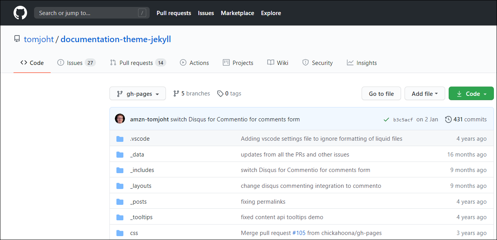
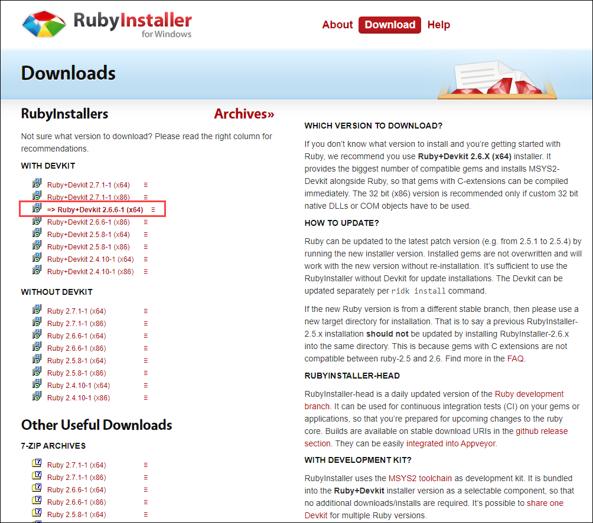
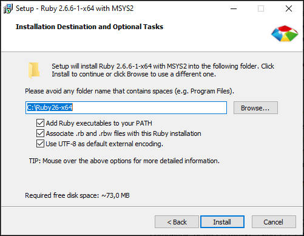

> When I first started exploring the CI/CD and the SSGs, the first generator that I learned was Jekyll. I used [Getting started with the Documentation Theme for Jekyll](https://idratherbewriting.com/documentation-theme-jekyll/) by Tom Johnson, the famous guru of technical writing known by his [I'd Rather Be Writing blog](https://idratherbewriting.com/).

So without too many words, let's start building our first documentation portal using Tom's Jekyll theme. I will try to explain even the evident things.

---

## Download or clone the theme from the [GitHub repo](https://github.com/tomjoht/documentation-theme-jekyll)

1. Sign up for GitHub.


2. If you already have the account there, sign in.


3. Now if you follow the [link to Tom's repo](https://github.com/tomjoht/documentation-theme-jekyll), you will see the contents of this repo that has the code and content for his example [documentation site](https://idratherbewriting.com/documentation-theme-jekyll/).



4. Click the **Code** button and select **Download ZIP**.


5. Save the ZIP file to your computer and unzip the contents where you like. Now you have the folder with code and content. Let's proceed with building our documentation site from all this.

---

## Install Ruby on Windows

> Before we install Jekyll that compiles our site, we need to install Ruby. Jekyll is a Ruby-based program and needs Ruby to run.

1. Go to [RubyInstaller for Windows](https://rubyinstaller.org/downloads/).
2. Install the recommended **Ruby+Devkit 2.6.X (x64)** version.



3. Install everything by default.



3. When the installation completes, you see this command prompt screen. Press `Enter` two times when prompted.


4. When the installation in the command prompt exits, let's assume that we have Ruby installed. If you want to make sure, open the command prompt and type `ruby -v` and press `Enter`.


---

## Install Jekyll

1. To install Jekyll, enter `gem install jekyll` in the command prompt and press `Enter`.

2. Check if Jekyll has been installed properly: enter `jekyll -v` and press `Enter`.


---

## Install Bundler

1. Browse to the directory where you downloaded the Documentation theme for Jekyll.

2. Delete the existing `Gemfile` and `Gemfile.lock` files.


### Change directory

First, you need to change the directory in the Command Prompt.

1. In your file explorer, copy the path to the unzipped folder with your project.


2. In the Command prompt, enter cd and right-click to paste the copied path.


3. Press `Enter` to change the directory. Now you can execute commands in the project directory.

---

### Install Bundler

1. To install Bundler, enter `gem install bundler` and press `Enter`.


2. Enter the following commands:

```powershell
bundle init
bundle install
```

